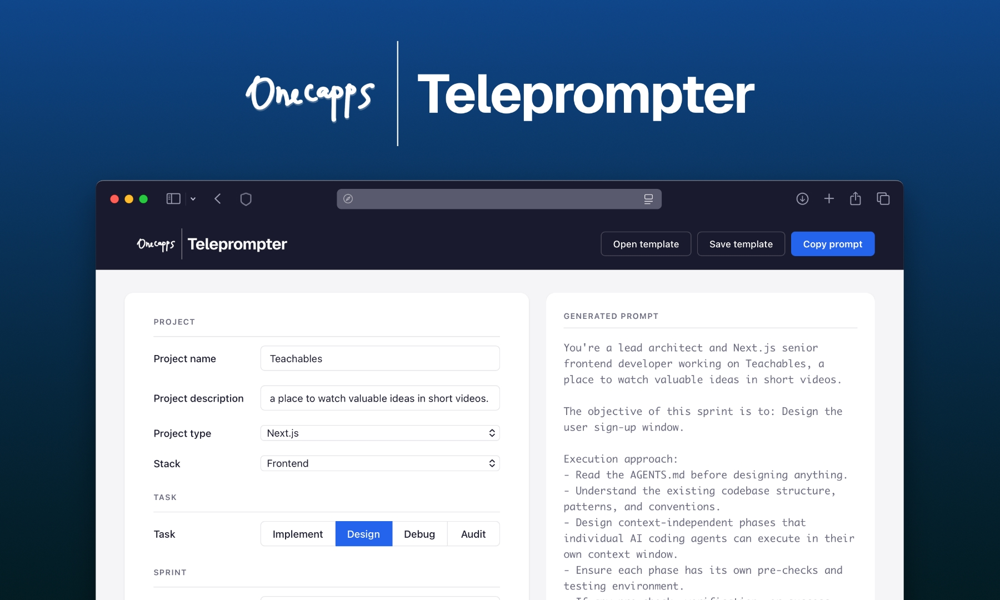

  

# Teleprompter

A local web tool to author prompts for AI coding agents. No server, no build step, no backend — open `index.html` from disk and build better prompts, faster.

**Try it online:** https://onecappsteleprompter.vercel.app/

## Usage

1. Clone or download this repository.
2. Open `index.html` in any browser.
3. Fill in the form (project, task, sprint, documents, MCPs, skills).
4. The right pane shows the generated prompt live. Click **Copy prompt** to copy it to the clipboard.
5. Use **Save template** / **Open template** to save and reload a form state as JSON.
6. Optional: click **Dictate** and describe your project out loud; the form fills in and you tweak it by hand.

## How it works

Two core files:

- `index.html` — the executable: markup + inline CSS + inline JS. Open by double-click.
- `database.js` — the database: all editable prompt fragments, dropdown options, role templates, task lists. Edit this to change what the generated prompts say; never edit `index.html` for content changes.

`database.js` is loaded via `<script src>` in `<head>` (synchronous, no `fetch()`, no CORS, works on `file://`). Prompt generation itself is deterministic — same form state always produces the same prompt, with no LLM or inference in that step. Voice input (below) is the one place an LLM enters the picture, and only to fill in form state that you then review.

## Voice input

Click the microphone button and describe your project out loud — Teleprompter transcribes it and fills in the form for you to review and adjust. A second dictation patches only the fields you mention, leaving the rest alone, so a correction like "actually make it a debug task" doesn't make you start over.

This needs your own **Groq API key**: a free Groq account needs no credit card and covers roughly 100 dictations a day. Get one at [console.groq.com/keys](https://console.groq.com/keys) and paste it into the app's Voice settings dialog. Without a key the mic button is disabled — the feature is unavailable, not degraded; there's no free tier of the feature itself, only of the key.

Dictation needs **an internet connection** — it calls a cloud API (Groq), so it is not an offline feature. Everything else about the app still needs no server and no build step — just the double-clicked file.

## Documentation

- [`AGENTS.md`](AGENTS.md) — canonical technical reference (architecture, state shape, prompt assembly order, conventions).
- [`changelog.md`](changelog.md) — notable changes, newest first.

## Security

`database.js` is **executable JavaScript**, not inert data — it is loaded as a `<script>` and runs in the page. Only use a `database.js` from a source you trust. Do not accept `database.js` files or template JSON from untrusted sources. Template JSON is parsed with `JSON.parse` (no code execution), but `database.js` itself is code. If you use voice input, your Groq API key is stored in `localStorage` and is readable by anything running on the page — including a modified `database.js` — so only load a `database.js` you trust, and use a key you can rotate.

## License

See repository metadata. No third-party dependencies.
